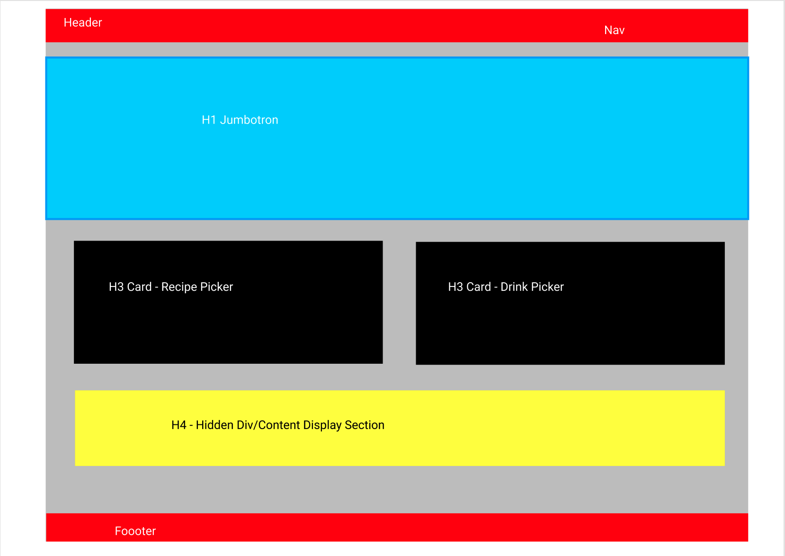

# redesigned-broccoli - Team 6

# DESCRIPTION
Redesigned Broccoli is a food app designed to show users recipies based on certin search criteria - like ranodm, by ingredient, or by cuisine. Additional features include a drink recipe randomizer, 
based on user input of alcoholic or non-alcoholic input choices. Pick recipes by ingredients, cuisine; place all of those things into a shopping list and find a drink to pair with you meal all from one interface. 

Redesigned Broccoli is aimed at users 18-34, primarily focused on college students and young adults entering the workforce full time.
The goal of Redesigned Broccoli is to inspire people to cook more often in their homes, help meal plan and budget, as well as pair cocktails (alcoholic, and non alcoholic) to impress and wow friends and family. 

WIREFRAME
`
    
    
The site is designed around the simplest user experience on page load. There is minimal content and distraction - getting the user to the recipes they need faster. 

LAUNCH PRODUCT
`    
    

# TABLE OF CONTENTS
    - [Installation](#installation)
    - [Usage](#usage)
    - [Credits + Contacts](#credits)
    - [License](#license)

# INSTALLATION
Clone the working directory to a local machine and open the index.html file in your preferred browser. 

## USAGE
There are two main features - food and drink. Food recipies can be selected by random, using the lefthand button or by using the search bar to search by key ingredients. Using the right hand button will serve random drink recipes. 

All served recipies will be saved to browser local storage for easy recall and improved user experience. 

## CREDITS + CONTACTS
Development done by Jean-Tae Francies, Mitchell Routman, Yujen Chen, Vy Nguyen. 
Reset CSS provided by 

Contacts: 
    - Vy Nguyen: https://github.com/Vy187
    - Yujen Chen: https://github.com/yujengogo
    - Jean-Tae Francis: https://github.com/jfrancis268
    - Mitchell Routman: https://github.com/mitchroutman

## LICENSE 

MIT License

Copyright (c) [2022] [Vy Nguyen, Yujen Chen, Jean-Tae Francis, Mitchell Routman]

Permission is hereby granted, free of charge, to any person obtaining a copy
of this software and associated documentation files (the "Software"), to deal
in the Software without restriction, including without limitation the rights
to use, copy, modify, merge, publish, distribute, sublicense, and/or sell
copies of the Software, and to permit persons to whom the Software is
furnished to do so, subject to the following conditions:

The above copyright notice and this permission notice shall be included in all
copies or substantial portions of the Software.

THE SOFTWARE IS PROVIDED "AS IS", WITHOUT WARRANTY OF ANY KIND, EXPRESS OR
IMPLIED, INCLUDING BUT NOT LIMITED TO THE WARRANTIES OF MERCHANTABILITY,
FITNESS FOR A PARTICULAR PURPOSE AND NONINFRINGEMENT. IN NO EVENT SHALL THE
AUTHORS OR COPYRIGHT HOLDERS BE LIABLE FOR ANY CLAIM, DAMAGES OR OTHER
LIABILITY, WHETHER IN AN ACTION OF CONTRACT, TORT OR OTHERWISE, ARISING FROM,
OUT OF OR IN CONNECTION WITH THE SOFTWARE OR THE USE OR OTHER DEALINGS IN THE
SOFTWARE.

==